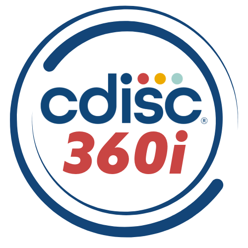
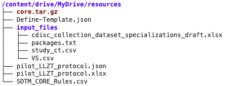
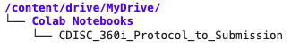

# Abstract #

CDISC 360i defines a vision and roadmap to enable standards-driven automation across the clinical research data life cycle - from study design to analysis. The purpose of these notebooks is to demonstrate the 360i Technical Roadmap by showcasing a strategy for research data pipeline automation using end-to-end, machine-readable standards metadata.

These notebooks automate study design using concepts and a standardized model to build a digital protocol. Aligned Case Report Forms (CRFs) and SDTM resources will be automatically generated as downstream artifacts using metadata from the digital protocol.

# Notebooks #

Currently, these notebooks are designed to execute in the [Google Colaboratory](https://colab.google.com/) environment.

Future releases will support additional notebook environments, object stores and databases.

## Description

|Notebook                       |Notes
|-------------------------------------------|-------------------------------------------------------------------|
|CDISC_360i_Protocol_to_Submission          |* Shown at CDISC Interchange                                       |
|                                           |* Copies study artifacts to local filesystem prior to copying to Object Store  |
|                                           |* Uses Google Drive as Object Store                                |
|                                           |* Requires Colab env setup for Google Drive                        |
|                                           |* Development has stopped for this version                         |
|CDISC_360i_Object_Store_Automation         |* Does not copy study artifacts to local filesystem, but works entirely with objects in Object Store    |
|                                           |* Uses Google Drive as Object Store                                |
|                                           |* Requires Colab env setup for Google Drive                        |
|                                           |* Development will continue as new tools and features become available |

## How To ##

1. Clone the repository or download a notebook
2. Access [Google Colaboratory](https://colab.google.com/) using your Google account.
3. Setup MyDrive to match URL requirements of notebook.  The directory structure in GooGle Drive should appear as:

    

    This will ensure the code cells in the CDISC_360i_Protocol_to_Submission notebook.

4. Copy the CDISC_360i_Protocol_to_Submission notebook to the myDrive/Colab Notebooks dirctory:

    

5. A custom distribution of the CDISC CORE Rules Engine will be required for execution of CORE Validation Rules in the notebooks.  This distribution will need to be built for the system hosting the notebooks.  Instructions are available here:

    https://github.com/cdisc-org/cdisc-rules-engine/blob/main/README_Build_Executable.md

    The custom distribution used in the notebooks is too large for GitHub.

    Ensure the new distribution is archived as core.tar.gz and stored as shown in the image above.

## Resources ##
**Other GitHub projects used in the notebooks**

|Project                            |GitHub Repository                                                                          |
|-----------------------------------|-------------------------------------------------------------------------------------------|
|Study Definition Workbench         |https://github.com/data4knowledge/study_definitions_workbench                              |
|Open Study Builder                 |https://gitlab.com/Novo-Nordisk/nn-public/openstudybuilder/OpenStudyBuilder-Solution       |
|Study USDM documents               |https://github.com/cdisc-org/360i/tree/main/data/protocol/LZZT/usdm                        |
|USDM validation utility            |https://github.com/pendingintent/cdisc-json-validation                                     |
|CDISC CORE Rules Engine            |https://github.com/cdisc-org/cdisc-rules-engine                                            |
|CRF creation                       |https://github.com/lexjansen/cdisc360i-pocs                                                |
|Trial Design Dataset creation      |https://github.com/pendingintent/cdisc-usdm-utils                                          |
|Define-XML template creation       |https://github.com/dostiep/360i                                                            |
|Define-XML creation                |https://github.com/swhume/template2define                                                  |
|Raw subject data                   |https://github.com/alidootson/UpdatedCDISCPilotData/tree/main/UpdatedCDISCPilotData/CDASH  |